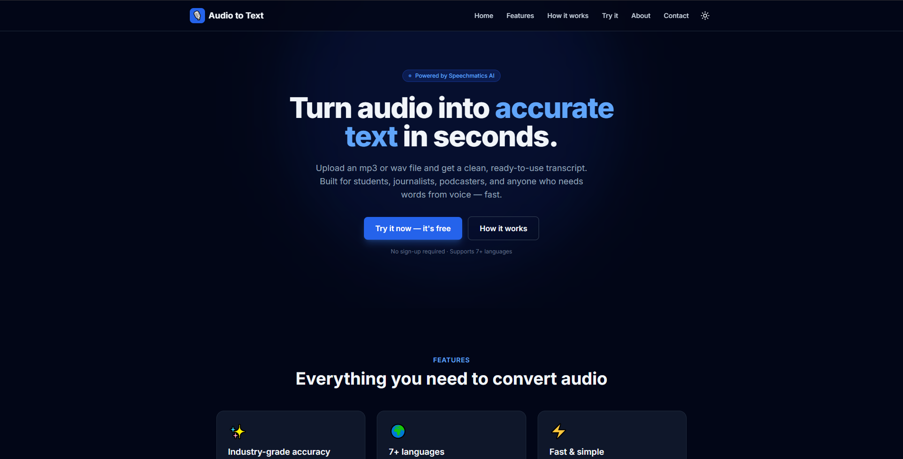
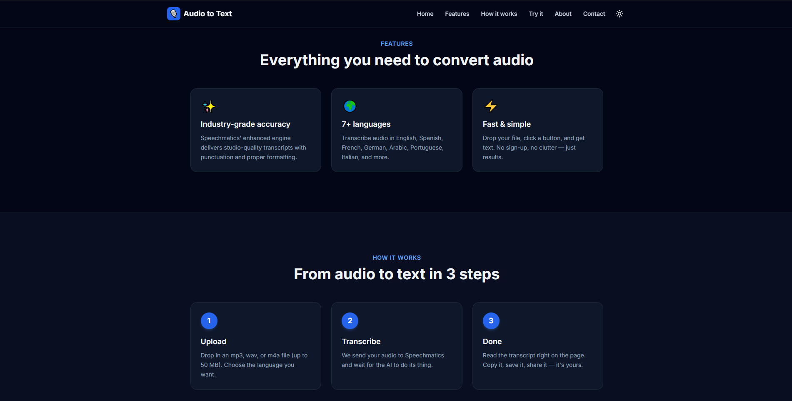
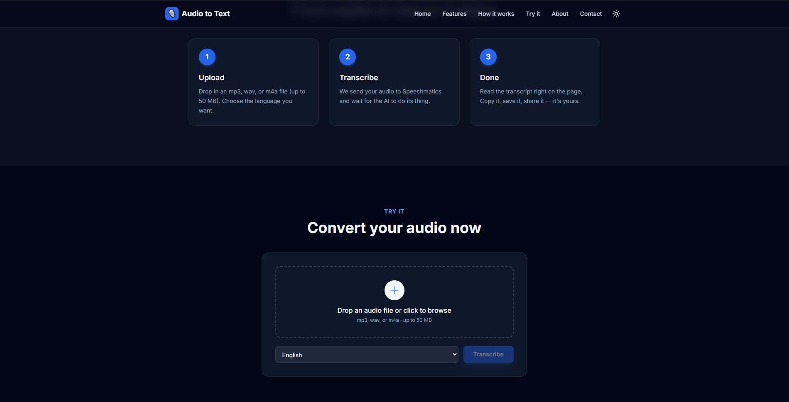
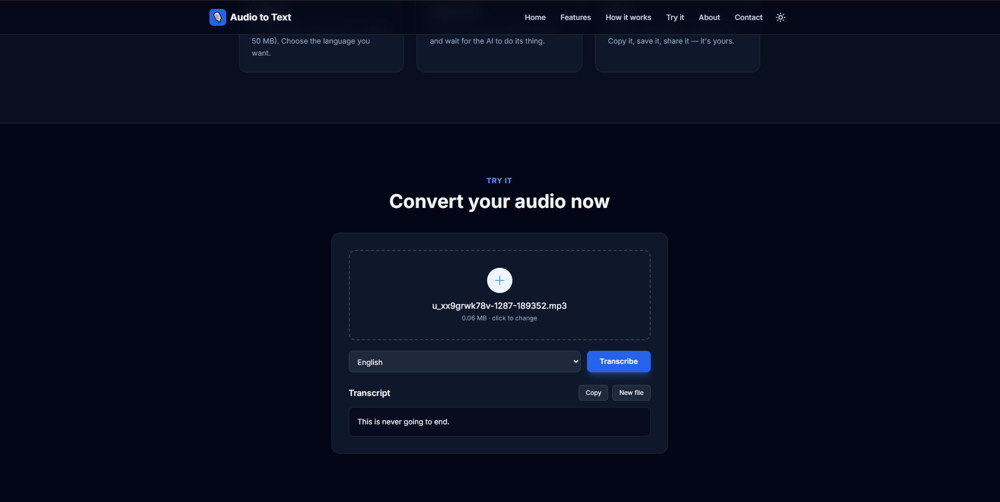

# 🎙️ Audio to Text

> Convert audio files into accurate text in seconds — built with React, Vite, and Tailwind CSS, powered by the Speechmatics AI API.


---

## ✨ Live Preview

📽️ **[Watch the 60-second demo video](https://www.loom.com/share/bcf2808c51784ebd830b86fc708c8130)** — *(replace with your Loom link)*

> 📸 _Add a screenshot of your app here. Save it as `screenshot.png` in the project root, then update the line below._

### 📸 Screenshots

| Landing Page | Features | Converter | Result |

|  |  |  |  |

---

## 🚀 What is it?

A clean, single-page web app that takes an audio file (mp3, wav, or m4a) and returns a fully formatted transcript using the **Speechmatics speech-to-text AI**. Built as a learning project to deepen my understanding of React fundamentals, async API integration, and modern CSS workflows with Tailwind.

The app supports **7+ languages**, includes **dark mode** with system-preference detection, and is fully **responsive** down to mobile.

---

## 🎯 Features

- 🎵 **Drag-and-drop file upload** with validation (file type + size)
- 🌍 **Multi-language transcription** — English, Spanish, French, German, Arabic, Portuguese, Italian
- 🌓 **Dark / light theme toggle** that remembers your preference
- 📱 **Fully responsive** — built mobile-first
- ⏳ **Async polling** — handles long-running AI jobs cleanly
- 📋 **One-click copy** for transcripts
- 🎨 **Scroll-reveal animations** powered by IntersectionObserver
- ✉️ **Contact form** with client-side validation

---

## 🛠️ Tech Stack

| Layer | Tech |
|---|---|
| **Frontend Framework** | React 18 |
| **Build Tool** | Vite |
| **Styling** | Tailwind CSS |
| **AI / API** | Speechmatics Speech-to-Text |
| **Language** | JavaScript (ES6+) |
| **Hosting (planned)** | — see Security Note below |

---

## 🧠 What I Built (Key React Patterns)

This project gave me hands-on practice with:

- 🪝 **`useState` & `useEffect`** — managing UI state and side effects across multiple components
- 🎯 **`useRef`** — programmatically triggering hidden file inputs
- 🧩 **Component composition** — splitting one large UI into 8 focused sub-components
- 🔼 **Lifting state up** — theme state lives in `App.jsx`, controlled from `Navbar.jsx`
- 🪝 **Custom hooks** — built `useScrollReveal()` to encapsulate IntersectionObserver logic
- 🗺️ **Data + `.map()` rendering** — features and steps stored as data, rendered dynamically
- 🎛️ **Controlled forms** — `value` + `onChange` pattern for predictable form state
- 🔁 **Async / await polling** — implementing a clean polling loop for long-running API jobs
- 🌗 **Dark mode** — class-based, persisted to `localStorage`, respects system preference
- 🛡️ **Error & loading states** — every async call has clear UI feedback

---

## 📂 Project Structure

```
audio-to-text-v2/
├── index.html
├── tailwind.config.js
├── vite.config.js
└── src/
    ├── main.jsx                  # React entry point
    ├── App.jsx                   # Top-level component, theme management
    ├── speechmatics.js           # Pure JS — talks to the Speechmatics API
    ├── useScrollReveal.js        # Custom hook for scroll animations
    ├── index.css                 # Tailwind + reveal animation
    └── components/
        ├── Navbar.jsx            # Sticky nav, theme toggle, mobile menu
        ├── Hero.jsx              # Landing hero
        ├── Features.jsx          # 3-card features grid
        ├── HowItWorks.jsx        # 3-step explanation
        ├── Converter.jsx         # The core upload + transcribe UI
        ├── About.jsx             # Bio + skill chips
        ├── Contact.jsx           # Contact form with validation
        └── Footer.jsx
```

---

## 🏃 Running Locally

### 1. Clone the repo
```bash
git clone https://github.com/Adhamhany-hub2/audio-to-text.git
cd audio-to-text
```

### 2. Install dependencies
```bash
npm install
```

### 3. Get a Speechmatics API key
Sign up at [portal.speechmatics.com](https://portal.speechmatics.com) and create a key (free tier available).

### 4. Set up your environment
```bash
cp .env.example .env       # Mac/Linux
copy .env.example .env     # Windows
```

Open `.env` and paste your key:
```env
VITE_SPEECHMATICS_API_KEY=your_actual_key_here
```

### 5. Run the dev server
```bash
npm run dev
```

Open [http://localhost:5173](http://localhost:5173) — that's it!

---

## 🔒 Security Note (Important!)

This version of the project calls Speechmatics directly from the browser. That means **the API key is bundled into the client-side JavaScript** — anyone visiting a deployed version could find it in DevTools.

**Why I did it this way:** to learn React deeply without backend complexity.
**Why I'm not deploying it publicly:** because exposing API keys is bad practice.

For the production-ready version, see my [**audio-to-text-saas**](https://github.com/Adhamhany-hub2) repo (coming soon) — same UI, but with a Node.js + Express backend that hides the API key, plus authentication and usage tracking.

This dual approach reflects my understanding of the security tradeoff between rapid prototyping and production deployment.

---

## 📚 What I Learned

- Modern React doesn't need class components — hooks cover everything
- Tailwind dramatically speeds up styling once you know the utilities
- Splitting a big component into focused pieces makes the code dramatically easier to reason about
- Async APIs that don't return immediately need careful UI feedback (loading, errors, progress)
- Environment variables in Vite are powerful but exposing them to the browser is a security tradeoff worth understanding
- Custom hooks turn one-off logic into reusable, testable building blocks

---

## 🚧 What's Next

- [ ] Add file size + duration display before submission
- [ ] Save transcripts to `localStorage` for persistence
- [ ] Add download-as-`.txt` button for transcripts
- [ ] Build the production version with Node.js backend (in progress)
- [ ] Deploy to Vercel once the backend version is ready

---

## 👋 About Me

I'm **Adham Hany**, a frontend developer focused on building modern, responsive web apps. Currently learning React deeply and exploring full-stack development.

- 💼 [LinkedIn](https://www.linkedin.com/in/adham-hany-3224a7344/)
- 💻 [GitHub](https://github.com/Adhamhany-hub2)
- 📧 adham0hany@gmail.com

---

## 📜 License

MIT — feel free to learn from this code.

---

<sub>Built with ☕ and curiosity. Powered by [Speechmatics](https://www.speechmatics.com/).</sub>
